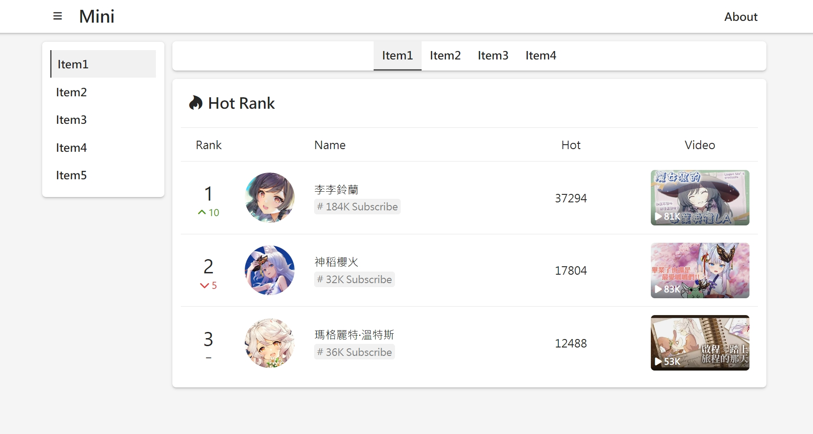

# Mini Form UI  

This is a mini RWD UI.  

It has styles for header, footer, left-menu, sub-menu, content, table, and backend engineers can use it to quickly develop website prototypes.  

---  

### Get Started  

Download and unzip the package.  
[releases/MiniFormUI-v1.0.2.zip](https://github.com/fysh711426/MiniFormUI/releases)

Import css and js.  

```Html
<link rel="stylesheet" href="mini-form-ui.min.css">
<script src="mini-form-ui.min.js"></script>
```  

---  

### Demo  

[https://fysh711426.github.io/mini-form-ui/index.html](https://fysh711426.github.io/mini-form-ui/index.html)  
[https://fysh711426.github.io/mini-form-ui/form.html](https://fysh711426.github.io/mini-form-ui/form.html)  
[https://fysh711426.github.io/mini-form-ui/modal.html](https://fysh711426.github.io/mini-form-ui/modal.html)  
[https://fysh711426.github.io/mini-form-ui/button.html](https://fysh711426.github.io/mini-form-ui/button.html)  
[https://fysh711426.github.io/mini-form-ui/file.html](https://fysh711426.github.io/mini-form-ui/file.html)  
[https://fysh711426.github.io/mini-form-ui/file-text.html](https://fysh711426.github.io/mini-form-ui/file-text.html)  
[https://fysh711426.github.io/mini-form-ui/file-image.html](https://fysh711426.github.io/mini-form-ui/file-image.html)  
[https://fysh711426.github.io/mini-form-ui/file-video.html](https://fysh711426.github.io/mini-form-ui/file-video.html)  
[https://fysh711426.github.io/mini-form-ui/file-search.html](https://fysh711426.github.io/mini-form-ui/file-search.html)  
[https://fysh711426.github.io/mini-form-ui/file-bookmark.html](https://fysh711426.github.io/mini-form-ui/file-bookmark.html)  

---  

* Desktop  

  

* Mobile  

  